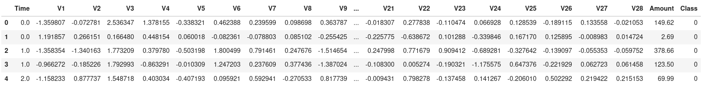
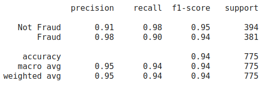
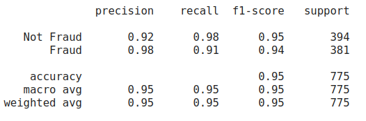
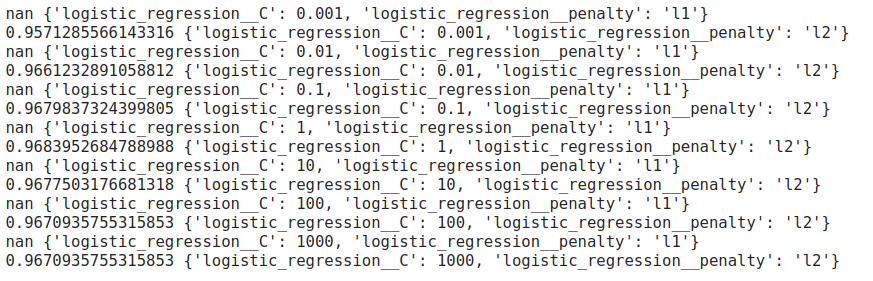

# fraud-detection
The repository contains code to analyze credit card transactions and predict whether transactions are fraudulent using machine learning algorithms. Machine learning workflow has been followed to train and fine-tune classification models. The steps are data collection and exploration, data processing, feature correlations, automating processing by pipelines, building models, evaluating performance by cross-validation, and fine-tuning the best-performing model based on precision, recall, and F1 score metrics.
The link to the kaggle dataset is: https://www.kaggle.com/datasets/mlg-ulb/creditcardfraud

To work with the code, clone the repository: 
git clone https://github.com/ShayanHodai/fraud-detection.git

The dataset:

The dataset is highly imbalanced as, less than 1% of total transactions are fraud

features histograms: as seen, most features are centred around 0
[View the PDF](images/features%20histogram.pdf)

Time and Amount features need scaling
Time feature is scaled by StandardScaler -> range between 0 to 1
and Amount feature is scaled by RobustScaler -> deals better with outliers
[View the PDF](images/two_features.pdf)

correlation of fraud/normal transactions with non-redundant features

Machine learning classification models evaluation metrics:
As the cost of False Positive and False Negative in this problem varies, Precision and Recall and, eventually, f1-score are the evaluation metrics of the model performance
Logistic regression:

KNN:

SVM:

Decision tree classifier, which is highly overfitting:

ROC carve:

Fine-tuning the best performing model, which is logistic regression:

Evaluation on the test set:

