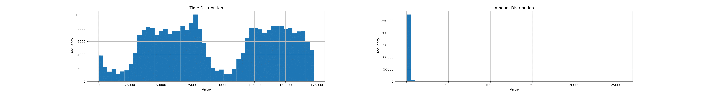

# Fraud Detection

## Description

This repository contains code to analyze credit card transactions and predict whether transactions are fraudulent using machine learning algorithms. The machine learning workflow includes data collection and exploration, data processing, feature correlation analysis, automated processing using pipelines, model building, performance evaluation through cross-validation, and fine-tuning the best-performing model based on precision, recall, and F1 score metrics.

The dataset used in this project is sourced from Kaggle: [Credit Card Fraud Detection Dataset](https://www.kaggle.com/datasets/mlg-ulb/creditcardfraud).

## Table of Contents

- [Installation](#installation)
- [Dataset](#dataset)
- [Data Processing](#data-processing)
- [Feature Selection](#feature-selection)
- [Machine Learning Models](#machine-learning-models)
- [Model Evaluation](#model-evaluation)
- [Fine-Tuning](#fine-tuning)
- [Evaluation on Test Set](#evaluation-on-test-set)
- [Contributing](#contributing)
- [License](#license)
- [Contact](#contact)

## Installation

To work with the code, clone the repository:

```bash
git clone https://github.com/ShayanHodai/fraud-detection.git
```

## Dataset


The dataset is highly imbalanced, with less than 1% of total transactions being fraudulent.


## Data Processing
Features histograms: Most features are centered around 0.


### Scaling

- `Time feature` is scaled using StandardScaler, resulting in a range between 0 and 1.
- `Amount feature` is scaled using RobustScaler, which deals better with outliers.



## Feature Selection

To address class imbalance in the dataset and create a balanced dataset, `random undersampling` is applied to reduce the number of instances in the majority class. This ensures that the machine learning model can learn to recognize patterns in both classes more effectively. After undersampling, the shape of the balanced dataset is (984, 31).

Correlation of fraud/normal transactions with non-redundant features


## Machine Learning Models:

The cost of false positives and false negatives varies in this problem, so precision, recall, and F1-score are used as evaluation metrics.

### Logistic regression


### KNN


### SVM


### Decision tree classifier
This model tends to overfit.


## Model Evaluation
`ROC carve:`


## Fine-Tuning 
Fine-tuning the best performing model, which is logistic regression:


## Evaluation on Test Set


## Contributing

Contributions to this project are welcome. To contribute, follow these steps:

1. Fork the repository.
2. Create a new branch (`git checkout -b feature-branch`).
3. Make your changes and commit them (`git commit -m 'Add new feature'`).
4. Push to the branch (`git push origin feature-branch`).
5. Create a new Pull Request.

Please ensure your code adheres to the project's coding standards and includes

## License

This project is licensed under the MIT License. See the [LICENSE](LICENSE) file for more details.

## Contact

For any questions or suggestions, please contact:
shayan.hodai@gmail.com
